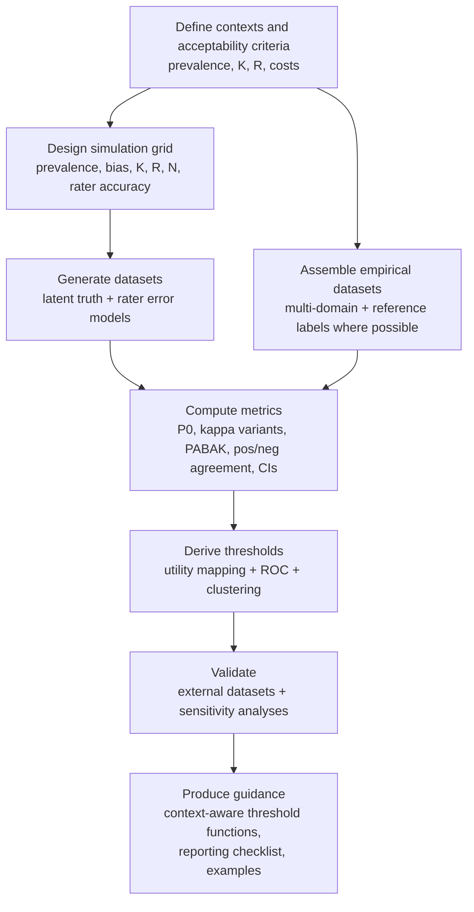

# Context-Aware Interpretation Thresholds for PABAK and Kappa-Type Agreement Metrics

## Executive summary

Interpretation “thresholds” for kappa-type coefficients are largely conventions rather than empirically validated, context-invariant standards.  The most widely reused qualitative labels for κ (e.g., “moderate,” “substantial”) originate from heuristic proposals, notably from the 1970s–1990s, and were not derived from a universal theory linking κ to decision risk, misclassification costs, or domain-specific consequences. citeturn0search0turn1search25turn2search2  

PABAK is not merely “κ with a small fix.”  Methodological syntheses emphasize that PABAK corresponds to a different chance-agreement model (uniform/“guessing” chance), and is mathematically identical to the Brennan–Prediger coefficient (and, for binary data, closely tied to Bennett–Alpert–Goldstein’s S). citeturn16search7turn9search0turn0search2  

Because PABAK is (for binary ratings) a linear transform of observed agreement (PABAK = 2P₀ − 1), any universal adjective scale for PABAK is implicitly an adjective scale for percent agreement.  That makes “PABAK-specific” cut points difficult to justify as fundamentally distinct from context-specific acceptability criteria on observed agreement, sensitivity/specificity, and downstream utility. citeturn0search2turn15search0turn14search1  

The strongest research framing, therefore, is not “invent another universal ladder,” but to develop and validate context-calibrated interpretations that explicitly condition on prevalence, marginal imbalance (bias), number of categories, rater count, and the decision setting.  Existing critiques and applied evaluations provide ample motivation: κ can behave paradoxically under prevalence/marginal imbalance, and PABAK can diverge sharply from κ and should not automatically be interpreted as measuring the same construct of “agreement beyond chance.” citeturn0search3turn0search11turn0search2turn15search0turn14search1  

## Prioritized annotated bibliography for threshold development

The entries below are ordered to support a literature review that begins with (i) what κ is, (ii) where qualitative thresholds came from, (iii) why prevalence/bias complicates interpretation, (iv) what PABAK actually is (mathematically and conceptually), and (v) modern reliability/reporting guidance and study-design considerations.

1) **entity["people","Jacob Cohen","psychologist, kappa author"].  1960.  “A Coefficient of Agreement for Nominal Scales.”  entity["organization","Educational and Psychological Measurement","academic journal"].  DOI: 10.1177/001316446002000104.**  
Summary: This is the seminal paper defining Cohen’s κ for nominal categories and formalizing chance-corrected agreement for two raters.  It establishes the basic κ structure (observed agreement vs expected chance agreement computed from marginal distributions), which later debates critique and modify. citeturn0search1  
Why it matters for PABAK thresholds: Any PABAK thresholding project must be explicit about what is being “corrected for chance” and which chance model is assumed.  PABAK’s chance model differs from Cohen’s, so thresholds cannot be justified by κ language without acknowledging the model shift. citeturn16search7turn0search1  
Suggested takeaway: κ is a chance-corrected agreement index whose expected-chance term is driven by the raters’ marginal distributions, making κ sensitive to prevalence and rater tendency patterns. citeturn0search1  

2) **entity["people","Jacob Cohen","psychologist, kappa author"].  1968.  “Weighted kappa: nominal scale agreement with provision for scaled disagreement or partial credit.”  entity["organization","Psychological Bulletin","academic journal"].  DOI: 10.1037/h0026256.**  
Summary: Cohen generalizes κ to ordered categories via weighting, which is directly relevant when PABAK-like adjustments are attempted for ordinal/graded ratings.  It also highlights that agreement measurement is partly a modeling choice (e.g., weight structure), not just a number to “interpret.” citeturn13search2  
Why it matters for PABAK thresholds: If your agenda extends PABAK-style calibration beyond binary outcomes, the interaction between (a) prevalence/marginals and (b) ordinal weighting becomes central.  Thresholds may need to be metric- and design-specific (unweighted κ, weighted κ, etc.). citeturn13search2turn2search2  
Suggested takeaway: For ordinal scales, the definition of “agreement” is partly encoded in the weight matrix, so any threshold scheme must specify the weighting method used. citeturn13search2  

3) **entity["people","J. Richard Landis","biostatistician, biometrics"] and entity["people","Gary G. Koch","biostatistician, biometrics"].  1977.  “The Measurement of Observer Agreement for Categorical Data.”  entity["organization","Biometrics","academic journal"].  DOI: 10.2307/2529310.**  
Summary: This paper formalizes generalized kappa-type approaches for categorical observer agreement and (crucially for practice) supplies the most widely reused qualitative descriptors for κ intervals (e.g., “fair,” “moderate,” “substantial”).  These labels became de facto thresholds in many applied fields. citeturn0search0  
Why it matters for PABAK thresholds: Your project can treat this scale as a historically influential but empirically under-justified starting point, then ask how to replace static cut points with context-conditional criteria.  It also provides the reference point most authors borrow when they label PABAK. citeturn0search0turn5search14  
Suggested quote/takeaway: The Landis–Koch descriptors are widely used for interpretability, but they function as heuristics rather than universally validated standards for all prevalence/marginal conditions. citeturn1search25turn0search0  

4) **entity["people","Joseph L. Fleiss","biostatistician, columbia"].  1971.  “Measuring nominal scale agreement among many raters.”  entity["organization","Psychological Bulletin","academic journal"].  DOI: 10.1037/h0031619.**  
Summary: Introduces Fleiss’ κ, extending chance-corrected agreement to multiple raters.  Multi-rater contexts are precisely where “thresholds” become more complicated because agreement structure and expected-chance terms differ from pairwise κ. citeturn1search8  
Why it matters for PABAK thresholds: A context-aware threshold program should explicitly handle rater count (2 vs many), because PABAK is predominantly discussed in 2×2 settings while many applications involve multiple raters or item-level aggregation. citeturn1search8turn2search3  
Suggested takeaway: Moving from two to many raters changes both estimation and interpretation because the agreement structure is no longer a single 2×2 table. citeturn1search8turn2search3  

5) **entity["people","E. M. Bennett","public opinion quarterly author"], entity["people","Renee Alpert","public opinion quarterly author"], and entity["people","A. C. Goldstein","public opinion quarterly author"].  1954.  “Communications Through Limited-Response Questioning.”  entity["organization","Public Opinion Quarterly","academic journal"].  DOI: 10.1086/266520.**  
Summary: This is the foundational source associated with Bennett–Alpert–Goldstein’s S family of agreement coefficients, which later work characterizes as using a uniform chance model (expected agreement = 1/K for K categories).  That uniform chance model is directly relevant to PABAK’s conceptual lineage. citeturn9search0  
Why it matters for PABAK thresholds: A defensible PABAK-threshold agenda should acknowledge that PABAK embodies a uniform/guessing chance assumption rather than marginal-based chance, and that threshold meaning changes with the assumed chance model. citeturn16search7turn9search0  
Suggested takeaway: PABAK’s “chance correction” is better framed as a deliberate alternative chance model (uniform guessing) than as a universal fix to κ. citeturn16search7turn9search0  

6) **entity["people","Robert L. Brennan","psychometrician, agreement stats"] and entity["people","Dale J. Prediger","psychometrician, agreement stats"].  1981.  “Coefficient Kappa: Some Uses, Misuses, and Alternatives.”  entity["organization","Educational and Psychological Measurement","academic journal"].  DOI: 10.1177/001316448104100307.**  
Summary: Reviews appropriate and inappropriate uses of κ and discusses alternative κ-like statistics under differing assumptions about marginal distributions (fixed vs free).  This paper is a key bridge between “κ as widely used” and “κ as conditional on design and assumptions,” which is exactly the posture needed for context-aware thresholds. citeturn1search27turn12search3  
Why it matters for PABAK thresholds: PABAK is identified in later syntheses as identical to the Brennan–Prediger coefficient under a uniform chance model.  Therefore, any PABAK thresholding framework can treat Brennan–Prediger as a theoretical anchor for why PABAK behaves differently than Cohen’s κ under skewed marginals. citeturn16search7turn12search3  
Suggested takeaway: Agreement coefficients encode assumptions about marginals and chance, so “one-size” thresholds can be misleading when assumptions differ across studies. citeturn12search3turn16search7  

7) **entity["people","Alvan R. Feinstein","clinician-epidemiologist, yale"] and entity["people","Domenic V. Cicchetti","psychologist, reliability research"].  1990.  “High Agreement but Low Kappa: I.  The Problems of Two Paradoxes.”  entity["organization","Journal of Clinical Epidemiology","academic journal"].  DOI: 10.1016/0895-4356(90)90158-L.**  
Summary: Seminal critique describing “paradox” behavior where observed agreement can be high while κ is low, often driven by imbalanced marginals.  This paper is routinely cited as the conceptual motivation for prevalence/bias adjustments and alternative agreement coefficients. citeturn0search3turn0search7  
Why it matters for PABAK thresholds: If thresholds are context-aware, they must anticipate paradox regimes and avoid labeling “low κ” as “poor reliability” without considering prevalence/marginal structure and uncertainty estimates.  The paradox framing can be used to justify conditioning thresholds on prevalence and on separate positive/negative agreement. citeturn0search3turn0search2turn2search2  
Suggested quote/takeaway: High observed agreement can coexist with low κ when marginal totals are highly imbalanced, so κ interpretation must incorporate prevalence and marginal structure. citeturn0search7  

8) **entity["people","Domenic V. Cicchetti","psychologist, reliability research"] and entity["people","Alvan R. Feinstein","clinician-epidemiologist, yale"].  1990.  “High agreement but low kappa: II.  Resolving the paradoxes.”  entity["organization","Journal of Clinical Epidemiology","academic journal"].  DOI: 10.1016/0895-4356(90)90159-M.**  
Summary: Proposes ways to “resolve” the paradoxes, notably by separating agreement on positives and negatives (rather than relying on a single omnibus index).  This is a key conceptual competitor to PABAK-style single-number “fixes.” citeturn0search11turn0search19  
Why it matters for PABAK thresholds: A threshold framework that is truly context-aware may need to treat single-number labeling as secondary, recommending dual reporting (e.g., positive and negative agreement) and tying “acceptable” thresholds to the error profile most relevant to the domain. citeturn0search11turn15search0  
Suggested takeaway: When prevalence is extreme, separate positive/negative agreement can be more decision-relevant than any single omnibus agreement coefficient. citeturn0search19  

9) **entity["people","Ted Byrt","clinical epidemiology author"], entity["people","Janet Bishop","clinical epidemiology author"], and entity["people","John B. Carlin","biostatistician, clinical epidemiology"].  1993.  “Bias, prevalence and kappa.”  entity["organization","Journal of Clinical Epidemiology","academic journal"].  DOI: 10.1016/0895-4356(93)90018-V.**  
Summary: Defines prevalence and bias indices and provides relationships showing how κ depends on observed agreement and these indices.  The paper is central to the PABAK lineage and to the idea that κ alone is an incomplete summary, motivating richer reporting. citeturn0search2turn5search8  
Why it matters for PABAK thresholds: Byrt et al. is the canonical citation to justify reporting prevalence/bias alongside κ and for introducing PABAK as a prevalence/bias adjusted measure.  It supports a threshold framework where the “interpretation” of an agreement coefficient is conditional on reported prevalence and bias indices. citeturn0search2turn1search22  
Suggested takeaway: Agreement studies should not report κ alone because κ can shift materially with prevalence and bias even when observed agreement is similar. citeturn0search2  

10) **entity["people","Fred K. Hoehler","epidemiologist, kappa prevalence"].  2000.  “Bias and prevalence effects on kappa viewed in terms of sensitivity and specificity.”  entity["organization","Journal of Clinical Epidemiology","academic journal"].  DOI: 10.1016/S0895-4356(99)00174-2.**  
Summary: Recasts κ paradox behavior using sensitivity and specificity concepts and discusses why “adjusted” κ values can mislead if they overestimate reliability under bias/prevalence effects.  It explicitly challenges the notion that statistical adjustments can “rescue” poor design or extreme-prevalence settings. citeturn14search1turn14search3  
Why it matters for PABAK thresholds: This is a direct caution against treating PABAK inflation as “better reliability.”  It supports a central hypothesis for your project: interpretability should be tied to the decision context and error tradeoffs (false negatives vs false positives), not a single adjusted coefficient. citeturn14search1turn15search0  
Suggested quote/takeaway: When prevalence/bias effects are present, “adjusted” omnibus agreement indices can overestimate reliability; interpretation should focus on design and error properties rather than a rescue statistic. citeturn14search3  

11) **entity["people","Henry Ka-Fung Mak","radiologist, pabak letter"], entity["people","K. K. W. Yau","statistician, radiology letter"], and entity["people","B. P. L. Chan","radiology letter author"].  2004.  “Prevalence-adjusted bias-adjusted κ Values as Additional Indicators to Measure Observer Agreement” (letter).  entity["organization","Radiology","journal, rsna"].  DOI: 10.1148/radiol.2321031974.**  
Summary: A highly cited clinical-imaging letter advocating PABAK as an additional indicator when κ is depressed by prevalence/bias conditions.  It is a prominent example of how PABAK entered applied health research practice. citeturn5search2turn15search14  
Why it matters for PABAK thresholds: Thresholds are often applied post hoc in applied settings.  This letter can be used to motivate your review of how PABAK is used (and labeled) in the field, and to justify an empirical audit/meta-analysis of labeling practices. citeturn5search2turn5search14  
Suggested takeaway: PABAK is frequently used as a companion statistic to κ in settings where prevalence imbalance is expected, implying interpretation should emphasize “why the discrepancy occurs,” not only the label. citeturn5search2turn0search2  

12) **entity["people","Guanmin Chen","health services researcher"], entity["people","Peter Faris","biostatistics author"], entity["people","Brenda Hemmelgarn","nephrologist, health data"], entity["people","Robin L. Walker","health data researcher"], and entity["people","Hude Quan","health data researcher"].  2009.  “Measuring agreement of administrative data with chart data using prevalence unadjusted and adjusted kappa.”  entity["organization","BMC Medical Research Methodology","academic journal"].  DOI: 10.1186/1471-2288-9-5.**  
Summary: Empirically demonstrates how κ and PABAK behave under different sampling schemes and prevalence regimes across many conditions.  The authors explicitly caution against interpreting PABAK as measuring the same agreement as κ, especially under low prevalence. citeturn15search0turn15search2  
Why it matters for PABAK thresholds: This is close to “validation” evidence for the interpretive problem.  It supplies a concrete empirical template for your proposed work: compare coefficients across controlled prevalence changes, and evaluate interpretability against richer information (cell counts, positive/negative agreement). citeturn15search0turn14search10  
Suggested quote (≤25 words): “PABAK values should usually not be interpreted as measuring the same agreement as kappa … for the condition with low prevalence.” citeturn15search2  

13) **entity["people","Anthony J. Viera","family medicine researcher"] and entity["people","Joanne M. Garrett","family medicine researcher"].  2005.  “Understanding interobserver agreement: the kappa statistic.”  entity["organization","Family Medicine","medical journal"].  PMID: 15883903.**  
Summary: A short, highly cited clinical-methods explainer of κ that highlights prevalence sensitivity as a practical limitation and points to adjustment methods.  It is often used to justify κ reporting in applied health papers. citeturn2search0turn2search4  
Why it matters for PABAK thresholds: It provides the practitioner-facing rationale that many papers use before applying Landis–Koch-type labels.  In your framing, it can anchor the observation that operational thresholding is often done for interpretability, yet without context calibration. citeturn2search4turn5search14  
Suggested takeaway: Clinical readers are routinely taught that κ is affected by prevalence and that “methods to overcome” this exist, but concrete guidance on interpretation under those methods remains underdeveloped. citeturn2search4turn15search0  

14) **entity["people","Julius Sim","primary care researcher"] and entity["people","Chris C. Wright","health researcher"].  2005.  “The kappa statistic in reliability studies: use, interpretation, and sample size requirements.”  entity["organization","Physical Therapy","medical journal"].  DOI: 10.1093/ptj/85.3.257.**  
Summary: A major applied-methods review emphasizing factors influencing κ magnitude (including prevalence and bias), interpretation considerations, and planning/sample-size issues for κ-based reliability studies.  It is widely cited in musculoskeletal and clinical measurement research. citeturn2search2turn2search22  
Why it matters for PABAK thresholds: It explicitly connects interpretation to study design and uncertainty (confidence intervals) and discusses PABAK as a related computation.  This aligns with a context-aware threshold program where cut points are conditional on precision and setting rather than intrinsic labels. citeturn3search24turn6search22  
Suggested takeaway: Agreement coefficients should be interpreted alongside design factors, prevalence/bias structure, and statistical uncertainty; sample size can be planned to target CI precision rather than relying on point-estimate labels. citeturn2search22turn6search22  

15) **entity["people","Kilem L. Gwet","statistician, irr"].  2002.  “Kappa Statistic is not Satisfactory for Assessing the Extent of Agreement Between Raters.”  (Technical paper, widely circulated).**  
Summary: Argues that κ has undesirable properties under certain conditions (including prevalence/marginal effects) and motivates alternative chance-corrected measures.  While the venue is not a traditional journal article, the paper is heavily cited and functionally influential in methodological discussions about κ-type indices. citeturn2search1  
Why it matters for PABAK thresholds: Your framing can use this as evidence that the field debates not just thresholds but the underlying definition of chance agreement itself.  Any context-aware threshold scheme must clarify which coefficient is being interpreted and why that coefficient’s chance model is appropriate for the context. citeturn2search1turn16search7  
Suggested takeaway: If chance agreement is misspecified, a “threshold” can become a labeling exercise with weak inferential meaning; selecting the agreement model precedes thresholding. citeturn2search1turn1search25  

16) **entity["people","Mousumi Banerjee","statistician, interrater review"], entity["people","Michelle Capozzoli","interrater review author"], entity["people","Laura McSweeney","interrater review author"], and entity["people","Debajyoti Sinha","statistician, interrater review"].  1999.  “Beyond kappa: A review of interrater agreement measures.”  entity["organization","The Canadian Journal of Statistics","academic journal"].  DOI: 10.2307/3315487.**  
Summary: Comprehensive review and critique of agreement measures beyond κ, including multi-rater and ordinal contexts, and the modeling assumptions behind each.  It is valuable for positioning PABAK as one of many responses to κ limitations rather than the endpoint solution. citeturn2search3turn2search15  
Why it matters for PABAK thresholds: Threshold derivation can be reframed as a broader “benchmarking and decision-use” problem for reliability measures.  This review justifies considering alternative metrics and reporting bundles (e.g., agreement plus prevalence plus uncertainty) rather than a single threshold table. citeturn2search3turn1search25  
Suggested takeaway: Agreement metrics are model-based summaries with different sensitivities; interpretation criteria should be metric-specific and context-specific, not purely numeric cut points. citeturn2search3turn1search25  

17) **entity["people","Terry K. Koo","researcher, icc guidelines"] and entity["people","Mae Y. Li","researcher, icc guidelines"].  2016.  “A Guideline of Selecting and Reporting Intraclass Correlation Coefficients for Reliability Research.”  entity["organization","Journal of Chiropractic Medicine","medical journal"].  DOI: 10.1016/j.jcm.2016.02.012.**  
Summary: Widely adopted guideline on selecting ICC forms, reporting, and rule-of-thumb interpretation categories based on the ICC estimate and its 95% CI.  It is influential because it ties interpretation to CI-based reasoning in reliability reporting practice. citeturn8search0turn8search4  
Why it matters for PABAK thresholds: It provides a model for what “context-aware” can look like in practice: interpretation linked to design choice (ICC form) and uncertainty (CI), not only the point estimate.  Your PABAK effort can parallel this structure—conditioning interpretation on prevalence/bias and CI width. citeturn8search0turn6search22  
Suggested takeaway: Interpretation should be anchored to the confidence interval (precision) and the reliability design, not solely a point estimate category. citeturn8search0turn6search22  

18) **entity["people","Patrick E. Shrout","psychologist, icc author"] and entity["people","Joseph L. Fleiss","biostatistician, columbia"].  1979.  “Intraclass Correlations: Uses in Assessing Rater Reliability.”  entity["organization","Psychological Bulletin","academic journal"].  DOI: 10.1037/0033-2909.86.2.420.**  
Summary: Foundational ICC paper distinguishing multiple ICC forms and linking them to the measurement design and intended generalization (single rater vs average of raters, random vs fixed raters).  It is the classic reference behind much of ICC practice that later guidelines (e.g., Koo–Li) operationalize. citeturn13search6turn13search16  
Why it matters for PABAK thresholds: It supports the argument that “reliability interpretation” must be conditional on the design and intended use.  This design-conditional mindset is directly transferable to PABAK thresholding, where prevalence and marginal structure play the role that ICC form plays in continuous measurement. citeturn13search6turn16search7  
Suggested takeaway: Reliability coefficients must be selected and interpreted in light of the design and intended generalization, not as generic numbers. citeturn13search6turn13search16  

## Comparison of interpretation threshold schemes

The table below summarizes the most commonly cited “threshold” schemes and how they are typically applied.  A key observation for your framing is that PABAK rarely has its own bespoke interpretation scheme; instead, applied papers often reuse a κ scheme (usually Landis–Koch) to label PABAK, despite PABAK reflecting a different chance model. citeturn16search7turn5search14turn15search0  

| Scheme (common name) | Origin year | Intended metric(s) | Numeric cut points (typical presentation) | Source / DOI | Common usage notes |
|---|---:|---|---|---|---|
| Landis–Koch qualitative labels | 1977 | κ-type coefficients (categorical agreement; often Cohen’s κ) | <0 Poor; 0.00–0.20 Slight; 0.21–0.40 Fair; 0.41–0.60 Moderate; 0.61–0.80 Substantial; 0.81–1.00 Almost perfect | 10.2307/2529310 citeturn0search0 | Most widely reused labels in health and social research.  Often applied to other coefficients (including PABAK) as a convenience even when the underlying chance model differs. citeturn5search14turn16search7 |
| Fleiss “poor / fair-to-good / excellent” rule of thumb | Commonly attributed to Fleiss-era guidance (often via Fleiss texts) | κ-type coefficients (especially in applied multi-rater contexts) | <0.40 Poor; 0.40–0.75 Fair to good; >0.75 Excellent | Frequently attributed to Fleiss; compiled in benchmarking summaries citeturn1search25turn10search25 | Often used because it is simpler than Landis–Koch.  Still heuristic; does not resolve prevalence/marginal sensitivity. citeturn1search25turn2search2 |
| Altman kappa interpretation (book-based rule of thumb) | 1991 (often cited) | κ-type coefficients | <0.20 Poor; 0.21–0.40 Fair; 0.41–0.60 Moderate; 0.61–0.80 Good; 0.81–1.00 Very good | Book-based; commonly reproduced citeturn8search30turn1search9 | Very common in clinical papers and tutorials.  Typically presented explicitly as a rule of thumb rather than a validated universal standard. citeturn1search9turn1search25 |
| Cicchetti–Sparrow style benchmarks (often used for ICC and sometimes κ) | 1981 (and later variants) | Item-level interrater reliability contexts; sometimes used as generic IRR guidance | A commonly reproduced variant: <0.40 Poor; 0.40–0.59 Fair; 0.60–0.74 Good; 0.75–1.00 Excellent | Original criteria paper (PMID-based access) citeturn12search2 | Mostly used as a practical guideline.  Relevant as an example of differentiating “statistically reliable” vs “clinically/practically reliable.” citeturn12search2turn12search10 |
| Koo–Li ICC interpretation | 2016 | ICC (continuous measurement reliability) | <0.50 Poor; 0.50–0.75 Moderate; 0.75–0.90 Good; >0.90 Excellent | 10.1016/j.jcm.2016.02.012 citeturn8search0turn8search4 | Explicitly encourages using the 95% CI of the ICC estimate as the basis for interpretation.  A good structural template for “context-aware” interpretation in categorical metrics. citeturn8search0turn6search22 |
| PABAK labeling practice (typical) | Post-1993 practice | PABAK (mostly binary) | Typically inherits Landis–Koch (or similar κ scales) | PABAK introduced via Byrt et al. 1993; practice examples in applied papers citeturn0search2turn5search14turn15search0 | Empirical studies caution that PABAK should not be interpreted as measuring the same agreement as κ under low prevalence.  This undermines uncritical reuse of κ adjective scales for PABAK. citeturn15search0turn14search1 |

## Research framing and agenda for context-aware PABAK interpretation thresholds

### Research gap

The literature supports two linked gaps.  First, widely used κ “interpretation thresholds” are heuristic, historically contingent, and insensitive to known drivers of κ magnitude (prevalence and marginal imbalance), which can induce paradoxical behavior and unstable labeling. citeturn0search3turn0search2turn2search2turn1search25  

Second, PABAK is frequently used as an “adjustment” for these issues, yet PABAK corresponds to a different chance model (uniform/guessing).  Empirical evaluations warn that PABAK can diverge from κ and should not be assumed to measure the same underlying “agreement beyond chance,” especially under low prevalence. citeturn16search7turn15search0turn14search1  

A context-aware threshold program, therefore, should not aim to declare universal cut points.  It should instead define interpretable decision-focused criteria for what “acceptable” agreement means under specified conditions (prevalence, rater bias structure, category count, rater count, sampling design, and outcome costs), and then map observed statistics (PABAK and related κ-type measures) to those criteria with validation. citeturn14search1turn15search0turn8search0  

### Research questions and testable hypotheses

A coherent agenda can be organized around the following questions, each paired with a falsifiable hypothesis suitable for simulation plus empirical validation.

**RQ1: Should “high/medium/low” interpretation thresholds for PABAK vary with prevalence and marginal imbalance, even though binary PABAK is a direct transform of observed agreement?**  
Hypothesis: For fixed PABAK (fixed observed agreement), the implied decision-relevant error profile (e.g., sensitivity to a rare positive) can vary substantially with prevalence and rater bias patterns, so fixed adjective thresholds will have inconsistent practical meaning across prevalence regimes. citeturn14search1turn15search0turn0search11  

**RQ2: Are there contexts where κ-based adjective scales systematically misclassify “practical acceptability” relative to decision-analytic criteria?**  
Hypothesis: Under severe prevalence imbalance, κ will label agreement as “low” despite high overall agreement, while PABAK may label it “high” despite poor minority-class agreement; both patterns can be inconsistent with decision-focused acceptability. citeturn0search3turn15search0turn14search1  

**RQ3: How should thresholds change with the number of categories (K) and whether categories are nominal vs ordinal?**  
Hypothesis: Increasing K changes expected agreement under uniform-chance models (central to PABAK/Brennan–Prediger) and changes κ behavior; therefore, a single threshold table across K is not defensible without conditioning on K and the category distribution. citeturn16search7turn13search2turn2search3  

**RQ4: How should thresholds change with the number of raters and the aggregation scheme (pairwise vs multi-rater, single vs average ratings)?**  
Hypothesis: Multi-rater settings (Fleiss’ κ, average-of-raters designs) yield different estimands and variances, so thresholds should be tied to the estimand and intended use (e.g., single-rater deployment vs panel decision). citeturn1search8turn13search6turn8search0  

**RQ5: Can “context-aware thresholds” be expressed as functions rather than constants, and do they improve interpretive validity?**  
Hypothesis: Threshold functions based on decision loss (false positive/false negative costs) and prevalence will better predict downstream decision quality than fixed cut points, and will generalize across domains more reliably. citeturn14search1turn15search0turn8search0  

### Recommended study designs

A robust program should triangulate evidence from simulation, empirical datasets, and synthesis of published practice.

**Simulation studies (core design).**  Use controlled data-generating mechanisms that vary prevalence, bias/marginal imbalance, number of categories, rater accuracy heterogeneity, and rater count.  Simulation is essential because it supplies “ground truth” for what agreement and misclassification mean in a given context and allows systematic exploration of paradox regimes. citeturn14search1turn15search0turn2search2  

**Empirical multi-domain datasets (external validity).**  Collect datasets with (a) multiple raters and (ideally) an adjudicated or longitudinal reference standard, or (b) repeated measures that allow stability checks.  The Chen et al. study is a template: it demonstrates how sampling and prevalence modulate κ and PABAK, and it recommends reporting cell counts and positive/negative agreement to support interpretability. citeturn15search0turn14search10  

**Meta-analysis or “practice audit” of published PABAK usage.**  Systematically review how PABAK is labeled (which threshold scheme is borrowed), which contexts trigger PABAK reporting, and whether papers provide required contextual information (prevalence, bias indices, cell counts).  This design directly addresses your motivating observation that the interpretive ladder for PABAK is not standardized. citeturn5search14turn16search7turn1search25  

### Statistical methods and operational definitions

**Data-generating models.**  For binary outcomes, model each rater via sensitivity/specificity (or equivalently, a confusion matrix against a latent/true class) and vary prevalence explicitly.  For nominal multi-class, specify a misclassification matrix per rater (Dirichlet priors for row probabilities are a practical simulation device).  For ordinal, incorporate distance-sensitive misclassification and evaluate both unweighted and weighted κ variants. citeturn14search1turn13search2turn2search3  

**Agreement estimators to compute.**  At minimum: observed agreement (P₀), Cohen’s κ (or weighted κ), PABAK, multi-rater κ (Fleiss), and complementary measures such as positive and negative agreement in 2×2 settings.  Include alternative chance-corrected coefficients (e.g., Brennan–Prediger explicitly) to make the chance-model distinction transparent. citeturn0search1turn16search7turn1search8turn0search11  

**Uncertainty quantification.**  Evaluate analytic standard errors and confidence intervals where appropriate, but prioritize interval estimation quality via simulation, because κ-related Wald approximations can misbehave in small samples and near boundary values.  Use CI-precision planning methods when designing the validation study. citeturn6search19turn6search22turn6search6  

**Decision-theoretic threshold derivation.**  Define acceptability classes using explicit loss functions (e.g., cost of false negatives vs false positives) and prevalence-weighted expected loss.  Then derive thresholds (or threshold functions) mapping observed coefficients to regions of acceptable expected loss, rather than mapping coefficients to adjectives by tradition. citeturn14search1turn15search0  

**Performance metrics for evaluating proposed thresholds.**  
Use: (i) misclassification rate of contexts into “acceptable/unacceptable” compared to a ground-truth criterion (e.g., minimum sensitivity/specificity, or maximum expected loss), (ii) calibration error of predicted decision quality, (iii) robustness across prevalence and category count, and (iv) stability of classification under sampling variability (bootstrap resampling). citeturn15search0turn6search22turn14search1  

### Sample size and power considerations

For agreement studies, sample size planning is often better expressed in terms of achieving confidence interval precision, not merely achieving “significance” or hitting a target point estimate.  Methods exist for κ sample size estimation based on desired CI width or desired lower CI bound, including for binary outcomes and multiple raters. citeturn6search22turn6search6turn6search19  

For your validation study, a practical approach is to plan sample sizes across two layers: (i) the simulation layer (number of Monte Carlo replicates per condition) until Monte Carlo standard error on performance metrics is acceptably small, and (ii) the empirical layer (number of items rated) to achieve adequate CI precision for each coefficient within each context stratum (prevalence band, category count, rater count).  CI-based planning aligns with the ICC guidance culture (e.g., Koo–Li’s emphasis on CI interpretation) and directly supports a context-aware thresholding goal. citeturn8search0turn6search22turn6search6  

### Validation strategies

**External dataset validation.**  Apply derived thresholds to datasets not used in derivation, ideally across different prevalence regimes and domains (clinical coding, imaging ratings, survey coding).  Compare predicted “acceptable” vs “unacceptable” categorizations to decision-relevant outcomes (e.g., error rates vs a reference standard, adjudication stability). citeturn15search0turn14search1  

**Sensitivity analyses.**  Explicitly vary (a) prevalence priors, (b) rater heterogeneity assumptions, (c) clustering/non-independence of items, and (d) missingness patterns where relevant, and reevaluate threshold stability.  This is responsive to the repeated critique that κ-type measures are sensitive to marginal structures and design assumptions. citeturn0search2turn12search3turn2search3  

**Comparative validity against alternative coefficients.**  Compare whether your threshold mappings behave more consistently than applying Landis–Koch or Altman labels directly to PABAK or κ.  Explicitly test whether “context-aware” mapping reduces paradoxical labeling (e.g., “poor” κ at high observed agreement or “excellent” PABAK when minority-class agreement is weak). citeturn0search3turn15search0turn14search1  

## Proposed validation study methods

This section is written as a concise methods draft suitable for a protocol or grant-style proposal.  It assumes no constraints on data sources beyond English-language reporting.

### Study objective

To derive and validate context-calibrated interpretation thresholds for PABAK and related κ-type agreement metrics by mapping these coefficients to decision-relevant criteria that vary with prevalence, marginal imbalance (bias), number of categories, rater count, and sample size.  The study explicitly treats existing fixed cut points (e.g., Landis–Koch) as historical baselines for comparison. citeturn0search0turn16search7turn15search0  

### Data sources

Empirical data will be assembled from multiple domains that routinely report κ and/or PABAK, prioritizing settings with either adjudicated reference labels or repeated measurements that support stability checks.  Candidate domains include clinical coding validation datasets (administrative vs chart review), medical imaging observer agreement studies, and survey item coding datasets. citeturn15search0turn5search2turn2search4  

### Simulation design

The simulation is designed to span regimes known to stress κ interpretation (prevalence imbalance, marginal asymmetry) and regimes where PABAK is commonly used as a supplement. citeturn0search3turn0search2turn15search0  

**Factors and ranges.**  The primary simulation grid will vary:

| Factor | Levels (illustrative) | Rationale |
|---|---|---|
| Prevalence of target/positive class (binary) or category distribution (multi-class) | Binary prevalence p ∈ {0.01, 0.05, 0.10, 0.20, 0.50, 0.80, 0.90, 0.95, 0.99}; Multi-class Dirichlet-controlled concentration with skew levels (low/medium/high) | κ paradoxes and PABAK divergence are strongly linked to prevalence and marginal imbalance. citeturn0search3turn15search0turn14search1 |
| Rater bias / marginal asymmetry | Systematic propensity shifts (e.g., one rater has higher positive rate than another); extend to multi-rater heterogeneity | Bias/marginal imbalance is central to Byrt et al.’s decomposition and to paradox discussions. citeturn0search2turn0search3 |
| Number of categories K | K ∈ {2, 3, 5, 7} with nominal and ordinal variants | PABAK/Brennan–Prediger uses uniform expected agreement 1/K; behavior depends on K. citeturn16search7turn13search2 |
| Number of raters R | R ∈ {2, 3, 5, 10} | Interpretation differs for pairwise vs multi-rater (e.g., Fleiss κ). citeturn1search8turn2search3 |
| Sample size N (items rated) | N ∈ {30, 50, 100, 200, 500, 1000} | Enables assessment of CI behavior and threshold stability under realistic study sizes. citeturn6search22turn6search19 |
| Rater accuracy model | Binary: sensitivity/specificity pairs; Multi-class: misclassification matrices with diagonal dominance levels | Supports decision-relevant evaluation beyond omnibus agreement. citeturn14search1turn0search11 |

**Data-generating process.**  
For binary outcomes, generate a latent true class Y with prevalence p.  For each rater r, generate observed rating X_r using sensitivity and specificity parameters (possibly rater-specific) relative to Y, allowing systematic bias by shifting parameters or thresholding functions.  For multi-class outcomes, generate Y from a controlled categorical distribution; then generate X_r via a rater-specific misclassification matrix. citeturn14search1turn15search0turn2search3  

### Estimation procedures

For each simulated dataset and each empirical dataset stratum, compute:

- Observed agreement P₀ and (for binary) positive and negative agreement summaries to expose asymmetric error patterns. citeturn0search11turn15search0  
- Cohen’s κ (unweighted for nominal; weighted for ordinal) and, where applicable, multi-rater κ (Fleiss). citeturn0search1turn1search8turn13search2  
- PABAK, reported explicitly as the Brennan–Prediger coefficient (uniform expected agreement model), to avoid conceptual ambiguity. citeturn16search7turn0search2  
- Confidence intervals for each coefficient using (a) analytic/large-sample approximations when available and (b) bootstrap resampling to evaluate interval performance and boundedness behavior. citeturn6search19turn6search22turn6search6  

### Threshold derivation approach

Three complementary derivation strategies will be evaluated, with the primary strategy selected based on interpretability and external validation performance.

**Strategy one: Decision-utility mapping (primary).**  
Define context-specific acceptability in terms of expected loss L under a cost model (false negative cost C_FN, false positive cost C_FP, optionally category-distance costs for ordinal K>2).  For each context, compute expected loss under the simulated rater model and label the context as “acceptable” if loss is below a prespecified threshold.  Fit a mapping from observed coefficients (PABAK, κ, and auxiliary metrics) to acceptability, producing threshold functions T(prevalence, K, R, cost ratio). citeturn14search1turn15search0turn13search2  

**Strategy two: ROC-style thresholds for acceptability classification (secondary).**  
Treat “acceptable vs unacceptable reliability” (as defined above) as the target and use ROC analysis to choose coefficient cut points that optimize a chosen criterion (e.g., minimize weighted misclassification, maximize Youden-type objective).  This yields explicit cut points that vary across contexts and can be summarized as functions. citeturn14search1turn15search0  

**Strategy three: Empirical clustering of coefficient distributions (exploratory).**  
Within each context stratum, cluster observed coefficient vectors (PABAK, κ, P₀, positive/negative agreement) and examine whether clusters correspond to meaningful differences in decision error or stability.  This provides a descriptive check on whether natural groupings exist that could support practical guidance categories. citeturn15search0turn2search3  

### Evaluation metrics

For each derivation strategy, evaluate:

- **Decision-classification accuracy:** misclassification rate of “acceptable/unacceptable” based on the ground-truth criterion from the data-generating model. citeturn14search1turn15search0  
- **Robustness:** stability of thresholds under changes in prevalence, bias, and rater heterogeneity. citeturn0search2turn15search0  
- **Uncertainty sensitivity:** how often CI uncertainty causes threshold-category changes (e.g., point estimate meets threshold but lower CI bound does not).  This parallels CI-based interpretive culture in modern reliability guidance. citeturn8search0turn6search22  
- **Comparative baseline performance:** compare against applying fixed Landis–Koch or Altman labels to κ and PABAK (as is common in practice) and quantify paradox-driven mislabeling. citeturn0search0turn1search9turn15search0  

### Sample size planning

Empirical components will target CI-based precision goals rather than only point-estimate interpretability.  Sample size guidance will be computed using established κ interval estimation planning methods (binary and multi-rater), selecting N so that the expected lower confidence limit exceeds a context-specific acceptability threshold in key strata. citeturn6search22turn6search6turn6search19  

Simulation components will use Monte Carlo replication counts sufficient to stabilize performance estimates (e.g., misclassification rates) to within prespecified Monte Carlo standard error bounds, with sensitivity checks at higher replication counts. citeturn6search22turn6search19  

## Study workflow and reporting artifacts

### Workflow

### Requested tables to include in the final study report

To make the work maximally reusable for readers, the final report should include at least the following tables (in addition to the threshold-scheme comparison already provided):

| Table | Purpose | Minimum contents |
|---|---|---|
| Simulation condition grid | Reproducibility and transparency of context coverage | Full parameter list with all levels for prevalence, bias, K, R, N, accuracy distributions; number of Monte Carlo replicates per cell |
| Metric computation specification | Prevents ambiguity about what was computed | Exact formulas and software implementation notes for κ variants, PABAK/Brennan–Prediger, positive/negative agreement; CI methods used |
| Derived thresholds by context | Main deliverable | Threshold functions or stratified cut points; performance metrics; example interpretations |
| External validation summary | Evidence of generalizability | Datasets used, context characteristics, observed performance, failure modes |

### Reporting checklist to align with the research gap

A context-aware threshold framework will be undermined if papers do not report the contextual variables required for interpretation.  The reporting checklist should therefore minimally require reporting cell counts (or marginal distributions), prevalence of categories, rater count and design, coefficient point estimates and confidence intervals, and (for binary outcomes) separate positive/negative agreement or equivalent error-profile information. citeturn15search0turn0search11turn6search22