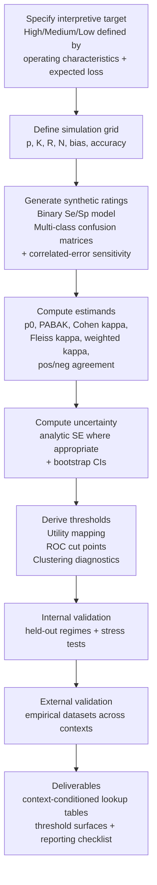

# Forward Simulation Plan for Context-Aware PABAK Interpretation Thresholds

## Executive summary

Prevalence-adjusted bias-adjusted kappa (PABAK) is widely used as a companion to (or substitute for) Cohen’s κ when κ appears “paradoxically” low under highly imbalanced marginal distributions or low-prevalence conditions. citeturn5view0turn1search3turn0search2  However, empirical work cautions that PABAK should usually not be interpreted as measuring the same agreement parameter as κ, particularly in low-prevalence settings, because PABAK fixes the prevalence and bias assumptions rather than estimating chance agreement from observed marginals. citeturn5view0turn0search2  

For binary outcomes, PABAK is a simple linear transformation of observed agreement (PABAK = 2 p₀ − 1). citeturn11view0turn5view0  As a result, any universal “high/medium/low” adjective ladder for PABAK is mathematically equivalent to a ladder for percent agreement. citeturn11view0turn5view0  The open methodological question is therefore not whether a single global ladder exists (it does not, with broad consensus), but how to derive and validate context-conditioned thresholds whose meaning is stable across prevalence, category structure, rater counts, and decision consequences. citeturn0search2turn1search3turn5view0turn14search1  

A forward plan centered on controlled simulation can explicitly define “high/medium/low” reliability in terms of ground-truth rater accuracy (e.g., sensitivity/specificity or misclassification matrices) and decision utility (expected loss under cost ratios that reflect the application). citeturn2search3turn5view0turn1search27  The simulation framework should then quantify how observed agreement (p₀), κ-family statistics (Cohen’s κ, Fleiss’ κ, weighted κ), and PABAK/Brennan–Prediger behave across a structured grid of prevalence, marginal asymmetry/bias, number of categories, rater count, and sample size. citeturn0search2turn6view2turn16search0turn18search0turn14search1turn5view0  

Threshold derivation should be treated as a supervised mapping problem: derive conditional cut points or functions that best predict ground-truth “high/medium/low” acceptability, using (i) decision-utility mapping, (ii) ROC-style boundary optimization, and (iii) clustering of coefficient vectors for descriptive validation. citeturn2search3turn5view0turn14search1  Validation should include held-out simulation regimes plus external empirical datasets, and should explicitly evaluate misclassification, calibration, robustness, and sensitivity to confidence-interval (CI) uncertainty. citeturn5view0turn18search7turn14search1  

## Conceptual framing for simulation-based PABAK thresholds

Cohen’s κ was introduced as a chance-corrected measure of agreement for nominal categories, comparing observed agreement to expected agreement under a chance model driven by raters’ marginal distributions. citeturn0search0  The practical difficulty is that κ is not only a function of p₀; it can change substantially with prevalence and rater marginal imbalance, motivating the canonical “high agreement but low κ” paradox literature. citeturn1search3turn0search2turn7view1  

PABAK emerged as a specific response to these issues.  In applied terms it is often described as “adjusting” κ for prevalence and bias, and in methodological terms it corresponds to using a fixed chance agreement assumption rather than estimating expected agreement from observed marginals. citeturn0search2turn5view0turn6view2  In the Chen et al. applied evaluation, PABAK is explicitly described as assuming 50% prevalence and absence of bias, and (under that definition) depending only on observed agreement. citeturn5view0  In an applied measurement validation manuscript, PABAK is given explicitly as PABAK = 2 p₀ − 1, which makes the dependence on p₀ transparent. citeturn11view0turn5view0  

This leads to an important inference for interpretation research: because binary PABAK is a linear transformation of p₀, the interpretive challenge is fundamentally about when a given level of p₀ is “acceptable,” which is not a purely statistical question and depends on prevalence, asymmetry of false-positive and false-negative costs, and (often) whether agreement is balanced across positive and negative decisions. citeturn2search3turn1search27turn5view0  The classic paradox-resolution line of work argues that, especially in imbalanced 2×2 regimes, a single omnibus number can conceal that agreement on positives and negatives differs, and recommends separate indices for positive and negative agreement. citeturn1search27turn7view1turn5view0  

Traditional qualitative “threshold” schemes (e.g., Landis–Koch) were introduced to aid communication of κ magnitudes, and have become widely reused in applied work. citeturn0search1turn7view1  The key methodological gap is that these qualitative ladders are not derived from a decision-theoretic calibration across prevalence, category count, rater count, and sample size, and they are often ported to statistics that instantiate different chance models (including PABAK and other κ-like coefficients) without validation. citeturn5view0turn6view2turn14search1  

Accordingly, a context-aware interpretation project should define “high/medium/low” agreement at the level of ground-truth performance and decision consequences, then empirically learn a mapping from observed coefficient values (and their uncertainty) to those categories across explicitly defined contexts. citeturn2search3turn5view0turn18search7turn14search1  

## Prioritized annotated bibliography

The list below is prioritized to support a simulation-centered PABAK threshold investigation: origins and chance models first, then paradoxes and prevalence/bias, then PABAK-focused evaluations, then modern alternatives and simulation/robustness, and finally reliability-reporting guidance that can inform reporting and CI-aware thresholding.

1. **entity["people","E. M. Bennett","communication researcher"], entity["people","R. Alpert","survey methods coauthor"], and entity["people","A. C. Goldstein","survey methods coauthor"].  (1954).  Communications through limited-response questioning.  *Public Opinion Quarterly*, 18(3), 303–308.  doi:10.1086/266520.  URL: https://academic.oup.com/poq/article-abstract/18/3/303/1907993** citeturn1search5  
Summary: This paper underlies the “S” family of agreement coefficients that later methodological syntheses relate to uniform-chance agreement expectations (expected agreement = 1/K categories). citeturn1search5turn6view2  It is part of the conceptual lineage used when PABAK (and Brennan–Prediger-type coefficients) are framed as using a fixed chance model rather than marginal-based chance. citeturn6view2  
Why it matters for PABAK thresholds: If PABAK thresholds are made context-aware, they must be explicit about the chance model being used.  The Bennett–Alpert–Goldstein lineage supports treating PABAK thresholds as thresholds for agreement under a uniform-chance assumption, not as calibrated “κ beyond chance” in the Cohen sense. citeturn6view2turn5view0  
Suggested takeaway: PABAK-style measures are best interpreted as adopting a different chance baseline (often related to uniform guessing), which changes what “high” means relative to Cohen’s κ. citeturn6view2turn5view0  

2. **entity["people","Jacob Cohen","psychologist statistician"].  (1960).  A coefficient of agreement for nominal scales.  *Educational and Psychological Measurement*, 20(1), 37–46.  doi:10.1177/001316446002000104.  URL: https://journals.sagepub.com/doi/10.1177/001316446002000104** citeturn0search0  
Summary: Introduces Cohen’s κ for nominal categories as agreement corrected for chance, with expected agreement computed from the raters’ marginal distributions. citeturn0search0  This framing is the baseline against which prevalence/bias critiques and PABAK’s alternative assumptions are evaluated. citeturn0search2turn1search3  
Why it matters for PABAK thresholds: Thresholds for PABAK cannot be justified as “κ thresholds” without addressing that PABAK does not use Cohen’s marginal-based chance term. citeturn5view0turn6view2  
Suggested takeaway: Cohen’s κ defines “beyond chance” using observed marginals, so context variables that change marginals (prevalence, rater tendencies) necessarily change the coefficient. citeturn0search0turn0search2  

3. **Cohen, J.  (1968).  Weighted kappa: nominal scale agreement with provision for scaled disagreement or partial credit.  *Psychological Bulletin*, 70(4), 213–220.  doi:10.1037/h0026256.  PMID: 19673146.  URL: https://pubmed.ncbi.nlm.nih.gov/19673146/** citeturn18search0  
Summary: Extends κ to ordinal ratings via weights, making explicit that “agreement” depends on how disagreements are scored. citeturn18search0  For thresholding projects that include ordered categorical scales, this paper anchors weighted κ as a primary estimand. citeturn18search0  
Why it matters for PABAK thresholds: If a PABAK threshold investigation generalizes to K>2 or ordinal settings, thresholds likely must differ across unweighted vs weighted agreement measures. citeturn18search0turn14search1  
Suggested takeaway: Interpretation must be tied to the estimand definition (including weights), because the same raw table can yield different agreement magnitudes under different weight structures. citeturn18search0turn14search1  

4. **entity["people","Joseph L. Fleiss","biostatistician"].  (1971).  Measuring nominal scale agreement among many raters.  *Psychological Bulletin*, 76(5), 378–382.  doi:10.1037/h0031619.  URL: https://europepmc.org/article/CTX/c6682** citeturn16search0  
Summary: Generalizes κ to the many-rater setting (Fleiss’ κ) and provides large-sample variance considerations for multi-rater designs. citeturn16search0  Many applied PABAK uses are pairwise, but real deployments often involve multiple raters, committees, or majority-vote decisions, which require multi-rater estimands. citeturn16search0  
Why it matters for PABAK thresholds: A context-aware threshold effort should condition thresholds on rater count (R) and on whether the operational decision uses one rater or an aggregate (e.g., majority vote). citeturn16search0turn14search1  
Suggested takeaway: “Agreement level” is design-dependent; multi-rater studies require estimands and interpretation that differ from two-rater 2×2 intuitions. citeturn16search0turn14search1  

5. **entity["people","J. Richard Landis","biostatistician"] and entity["people","Gary G. Koch","biostatistician"].  (1977).  The measurement of observer agreement for categorical data.  *Biometrics*, 33(1), 159–174.  doi:10.2307/2529310.  URL: https://www.jstor.org/stable/2529310** citeturn0search1turn0search5  
Summary: A highly influential methodological treatment of categorical observer agreement that also introduced the qualitative κ interpretation ladder that is widely reused (“slight,” “fair,” “moderate,” etc.). citeturn0search1turn7view1  The paper is among the main historical sources for the default “high/medium/low” style interpretations in applied reporting. citeturn0search1  
Why it matters for PABAK thresholds: Most published PABAK interpretations borrow Landis–Koch labels, yet Chen et al. caution that PABAK should not automatically be interpreted as the same parameter as κ, especially at low prevalence. citeturn5view0turn0search1  
Suggested takeaway: Landis–Koch is the de facto baseline ladder to benchmark against, but the ladder itself is a communication heuristic rather than a context-calibrated decision standard. citeturn0search1turn18search7  

6. **entity["people","Robert L. Brennan","psychometrician"] and entity["people","Dale J. Prediger","psychometrician"].  (1981).  Coefficient kappa: Some uses, misuses, and alternatives.  *Educational and Psychological Measurement*, 41(3), 687–699.  doi:10.1177/001316448104100307.  URL: https://journals.sagepub.com/doi/10.1177/001316448104100307** citeturn6view2turn1search0  
Summary: An early, high-impact critique of κ usage that emphasizes how assumptions about “fixed” vs “free” marginals affect what the chance term should be. citeturn6view2  It explicitly proposes that when marginals are free, the chance term in κ be replaced by 1/n (n = number of categories), which aligns mathematically with the uniform-chance logic often associated with PABAK/Brennan–Prediger-type coefficients. citeturn6view2turn5view0  
Why it matters for PABAK thresholds: This paper provides a principled way to describe PABAK not as a “fix,” but as an alternative marginal/chance model, which makes it natural to derive thresholds conditional on context (including K categories). citeturn6view2turn5view0  
Suggested takeaway: Before thresholding, select and justify the chance model.  Thresholds that ignore differing chance models risk labeling different constructs as if they were the same. citeturn6view2turn5view0  

7. **entity["people","W. Douglas Thompson","epidemiologist"] and entity["people","Stephen D. Walter","biostatistician"].  (1988).  A reappraisal of the kappa coefficient.  *Journal of Clinical Epidemiology*, 41(10), 949–958.  doi:10.1016/0895-4356(88)90031-5.  PMID: 3057117.  URL: https://pubmed.ncbi.nlm.nih.gov/3057117/** citeturn9search0  
Summary: A major epidemiologic critique of κ that discusses its dependence on prevalence and related interpretive problems, and helped motivate subsequent work on κ paradoxes and reporting alternatives. citeturn9search0turn1search3  It provides a clinical-epidemiology bridge between the statistical definition of κ and how κ behaves in measurement/diagnosis settings. citeturn9search0  
Why it matters for PABAK thresholds: Thresholds cannot be calibrated solely to κ magnitudes without addressing how prevalence shifts κ independent of practical performance.  This paper supports including prevalence as an explicit conditioning variable in any threshold function. citeturn9search0turn0search2  
Suggested takeaway: κ is not directly comparable across studies with different prevalence regimes without context adjustments or complementary reporting. citeturn9search0turn0search2  

8. **entity["people","Alvan R. Feinstein","clinical epidemiologist"] and entity["people","Domenic V. Cicchetti","psychologist statistician"].  (1990).  High agreement but low kappa: I.  The problems of two paradoxes.  *Journal of Clinical Epidemiology*, 43(6), 543–549.  doi:10.1016/0895-4356(90)90158-L.  PMID: 2348207.  URL: https://pubmed.ncbi.nlm.nih.gov/2348207/** citeturn1search3turn1search7  
Summary: The canonical “paradox” paper showing how κ can be low even when observed agreement is high, especially when marginal totals are imbalanced. citeturn1search7turn7view1  It strongly shaped applied skepticism about relying on κ alone and is frequently cited as motivation for prevalence/bias adjustments. citeturn1search3  
Why it matters for PABAK thresholds: A simulation-based threshold program should explicitly include the paradox regimes as stress tests, because these are precisely the regimes where PABAK and κ diverge and where naive thresholds are most likely to misclassify “acceptability.” citeturn1search3turn5view0  
Suggested takeaway: A stable interpretation scheme must account for table structure and not treat a single κ value as sufficient evidence of “low” or “high” reliability. citeturn1search7turn5view0  

9. **Cicchetti, D. V., and Feinstein, A. R.  (1990).  High agreement but low kappa: II.  Resolving the paradoxes.  *Journal of Clinical Epidemiology*, 43(6), 551–558.  doi:10.1016/0895-4356(90)90159-M.  PMID: 2189948.  URL: https://pubmed.ncbi.nlm.nih.gov/2189948/** citeturn1search27turn1search39  
Summary: Advances the paradox discussion by recommending separate indices for agreement on positives and on negatives, rather than relying on a single omnibus statistic. citeturn1search27turn7view1  This “two-index” perspective is especially relevant when prevalence is low and the minority class drives decision risk. citeturn1search27turn2search3  
Why it matters for PABAK thresholds: It motivates a thresholding approach that (i) conditions on prevalence and (ii) incorporates positive/negative agreement or error-profile constraints alongside PABAK/κ thresholds, reducing the risk of labeling high PABAK as “high reliability” when minority-class agreement is poor. citeturn1search27turn5view0  
Suggested takeaway: In imbalanced 2×2 regimes, “acceptable agreement” is often asymmetric across positive and negative decisions, so thresholds must be calibrated to the decision setting rather than a single omnibus number. citeturn1search27turn2search3  

10. **entity["people","Ted Byrt","epidemiologist"], entity["people","Janet Bishop","biostatistician"], and entity["people","John B. Carlin","biostatistician"].  (1993).  Bias, prevalence and kappa.  *Journal of Clinical Epidemiology*, 46(5), 423–429.  doi:10.1016/0895-4356(93)90018-V.  PMID: 8501467.  URL: https://pubmed.ncbi.nlm.nih.gov/8501467/** citeturn0search2turn0search6  
Summary: Defines indices for bias and prevalence and derives relationships highlighting how κ depends on these components in addition to observed agreement. citeturn0search6  This paper is the primary methodological locus from which PABAK is commonly cited in applied literature. citeturn0search2turn5view0  
Why it matters for PABAK thresholds: It provides the conceptual basis for conditioning interpretation on prevalence and bias indicators instead of applying a universal ladder.  It also motivates simulation factor grids that explicitly vary bias and prevalence independently. citeturn0search2turn5view0  
Suggested takeaway: Reporting κ alone can mislead comparisons across studies; interpretation should explicitly incorporate prevalence and bias, which are measurable and simulable context variables. citeturn0search6turn5view0  

11. **entity["people","Fred K. Hoehler","biostatistician"].  (2000).  Bias and prevalence effects on kappa viewed in terms of sensitivity and specificity.  *Journal of Clinical Epidemiology*, 53(5), 499–503.  doi:10.1016/S0895-4356(99)00174-2.  PMID: 10812322.  URL: https://pubmed.ncbi.nlm.nih.gov/10812322/** citeturn2search3  
Summary: Reframes κ behavior through sensitivity and specificity, clarifying how “paradox” behavior disappears when viewed as paired operating characteristics rather than as a single chance-corrected index. citeturn2search3  This paper directly links agreement statistics to the error-profile quantities that decision-utility calibration naturally uses. citeturn2search3  
Why it matters for PABAK thresholds: It supports defining ground-truth “high/medium/low” in terms of sensitivity/specificity (or more general misclassification matrices) and expected loss, then learning thresholds for PABAK/κ as predictive summaries of that ground truth. citeturn2search3  
Suggested takeaway: A context-aware threshold system should be anchored in operating characteristics (sensitivity/specificity) and decision consequences, not solely in omnibus κ-family magnitudes. citeturn2search3turn1search27  

12. **entity["people","Kilem L. Gwet","statistician"].  (2002).  Kappa statistic is not satisfactory for assessing the extent of agreement between raters.  (Technical report).  URL: https://agreestat.com/papers/kappa_statistic_is_not_satisfactory.pdf** citeturn2search2  
Summary: A widely cited methodological critique arguing that κ has undesirable properties in high-agreement or imbalanced-prevalence settings and motivating alternative chance-corrected coefficients. citeturn2search2turn10search0  Although not a peer-reviewed journal article, it is influential in shaping the modern debate about κ-like coefficients and interpretive ladders. citeturn2search2  
Why it matters for PABAK thresholds: Thresholding PABAK is part of a broader interpretive problem: different chance models yield different “agreement beyond chance” meanings.  This source helps motivate a threshold strategy that is coefficient-specific and explicit about the chance baseline. citeturn2search2turn6view2  
Suggested takeaway: If the agreement coefficient’s chance model is not appropriate for the study’s context, a numeric threshold will not repair the interpretability problem. citeturn2search2turn5view0  

13. **Gwet, K. L.  (2008).  Computing inter-rater reliability and its variance in the presence of high agreement.  *British Journal of Mathematical and Statistical Psychology*, 61(1), 29–48.  doi:10.1348/000711006X126600.  PMID: 18482474.  URL: https://pubmed.ncbi.nlm.nih.gov/18482474/** citeturn10search0turn10search3  
Summary: Investigates the origin of κ limitations in high-agreement settings and introduces AC1 as a more stable alternative under certain conditions, including variance estimation considerations. citeturn10search3turn10search0  It is a key technical bridge from “κ paradox critique” to “alternative chance models with different behavior.” citeturn10search3  
Why it matters for PABAK thresholds: A threshold project focused on PABAK must acknowledge that stability depends on the chosen agreement model.  Including AC1/alternative coefficients as comparators in simulation helps show whether PABAK thresholds add value or simply replicate percent-agreement thresholds. citeturn10search3turn11view0  
Suggested takeaway: Thresholds should be validated against known stress regimes (high agreement, skewed marginals), because this is where coefficients diverge and interpretive ladders fail. citeturn10search3turn1search3  

14. **entity["people","Anthony J. Viera","physician researcher"] and entity["people","Joanne M. Garrett","biostatistician"].  (2005).  Understanding interobserver agreement: the kappa statistic.  *Family Medicine*, 37(5), 360–363.  PMID: 15883903.  URL: https://pubmed.ncbi.nlm.nih.gov/15883903/** citeturn2search0turn7view1  
Summary: A highly cited applied-methods tutorial explaining κ in accessible terms and explicitly noting that κ is affected by prevalence, with discussion of paradox behavior and interpretive scales. citeturn7view1  It provides a clear example of how Landis–Koch-style thresholds became embedded in teaching and applied reporting. citeturn7view1turn0search1  
Why it matters for PABAK thresholds: It supports a “field reality” premise: users want simple labels, but the tutorial itself acknowledges prevalence sensitivity.  This motivates delivering context-aware lookup tables/functions that preserve usability while improving validity. citeturn7view1turn5view0  
Suggested takeaway: The demand for qualitative labels is practical, but responsible labeling requires conditioning on prevalence and on uncertainty, not only on the point estimate. citeturn7view1turn18search7  

15. **entity["people","Julius Sim","health measurement researcher"] and entity["people","Chris C. Wright","health measurement researcher"].  (2005).  The kappa statistic in reliability studies: use, interpretation, and sample size requirements.  *Physical Therapy*, 85(3), 257–268.  doi:10.1093/ptj/85.3.257.  PMID: 15733050.  URL: https://pubmed.ncbi.nlm.nih.gov/15733050/** citeturn18search7turn4view1  
Summary: A major applied review emphasizing that κ magnitude is influenced by prevalence, bias, and rating dependence, and discussing interpretation, confidence intervals, and sample size planning. citeturn4view1  The article explicitly references PABAK as a named adjustment approach in reliability practice. citeturn3search2turn5view0  
Why it matters for PABAK thresholds: This paper supports incorporating CI-aware interpretation and sample-size/precision planning into threshold definitions, rather than labeling based on point estimates alone. citeturn4view1turn18search7  
Suggested takeaway: A defensible threshold system should be built around both coefficient magnitude and precision (CI width or lower bound), because reliability interpretation changes when uncertainty is large. citeturn4view1turn2search1  

16. **entity["people","Mousumi Banerjee","statistician"] et al.  (1999).  Beyond kappa: A review of interrater agreement measures.  *The Canadian Journal of Statistics*, 27(1), 3–23.  doi:10.2307/3315487.  URL: https://onlinelibrary.wiley.com/doi/10.2307/3315487** citeturn18search1turn18search9  
Summary: A comprehensive review of agreement measures for nominal and ordinal ratings from multiple raters, with critique of κ-family measures and discussion of alternatives. citeturn18search1  It is an appropriate review anchor for positioning PABAK as one response among many, rather than as a definitive solution. citeturn18search1  
Why it matters for PABAK thresholds: Thresholding is not only about cut points; it is also about selecting metrics and reporting bundles.  This review can motivate including multiple estimands (p₀, κ, PABAK, positive/negative agreement) as the observable feature set from which thresholds are derived. citeturn18search1turn5view0  
Suggested takeaway: Because agreement coefficients reflect different modeling assumptions and sensitivities, any interpretation framework should be coefficient-specific and validated across realistic data regimes. citeturn18search1turn14search1  

17. **entity["people","Guanmin Chen","health services researcher"] et al.  (2009).  Measuring agreement of administrative data with chart data using prevalence unadjusted and adjusted kappa.  *BMC Medical Research Methodology*, 9:5.  doi:10.1186/1471-2288-9-5.  URL: https://link.springer.com/article/10.1186/1471-2288-9-5** citeturn5view0turn0search7  
Summary: Empirically compares κ and PABAK across many conditions and across sampling schemes that change prevalence, demonstrating that PABAK values can be consistently higher than κ and that the gap narrows as prevalence approaches 50%. citeturn5view0  The authors explicitly state that PABAK should usually not be interpreted as measuring the same agreement parameter as κ, particularly for low-prevalence conditions. citeturn5view0  
Why it matters for PABAK thresholds: This is a direct empirical motivation for context-aware thresholds: the same “true” coding process can yield very different κ vs PABAK impressions under different prevalence/sampling regimes. citeturn5view0  
Suggested takeaway: A threshold system that ignores prevalence and sampling design can systematically mislabel agreement; context-aware thresholds should predict decision-relevant acceptability rather than mimic fixed κ ladders. citeturn5view0turn0search2  

18. **entity["people","Werner Vach","biostatistician"].  (2005).  The dependence of Cohen’s kappa on the prevalence does not matter.  *Journal of Clinical Epidemiology*, 58(7), 655–661.  doi:10.1016/j.jclinepi.2004.02.021.  PMID: 15939215.  URL: https://pubmed.ncbi.nlm.nih.gov/15939215/** citeturn10search1turn10search5  
Summary: Provides a systematic discussion distinguishing different notions of “prevalence dependence” and argues that some prevalence dependence concerns do not invalidate κ in the way critics suggest. citeturn10search1  This paper is valuable for balance because it challenges overly simplistic narratives about κ and provides a rigorous framing of what “prevalence effects” mean. citeturn10search1  
Why it matters for PABAK thresholds: Threshold derivation should anticipate disagreement in the literature and should specify which interpretive target is being optimized (comparability across studies, decision utility, parameter estimation under a model).  Including Vach-type critique helps prevent building thresholds that merely encode a single viewpoint. citeturn10search1turn6view2  
Suggested takeaway: A threshold framework should clarify the interpretive objective (comparability, decision performance, or parameter recovery), because different objectives yield different “best” thresholds. citeturn10search1turn2search3  

19. **entity["people","Terry K. Koo","research methodologist"] and entity["people","Mae Y. Li","research methodologist"].  (2016).  A guideline of selecting and reporting intraclass correlation coefficients for reliability research.  *Journal of Chiropractic Medicine*, 15(2), 155–163.  doi:10.1016/j.jcm.2016.02.012.  PMID: 27330520.  URL: https://pubmed.ncbi.nlm.nih.gov/27330520/** citeturn2search5turn2search1  
Summary: Provides modern guidance for choosing ICC forms and interpreting/reporting ICCs, including CI-aware qualitative categories. citeturn2search1  While not about PABAK, it is influential in reliability reporting culture and is a useful template for how to operationalize interpretive guidance that respects design choices and uncertainty. citeturn2search1  
Why it matters for PABAK thresholds: Your PABAK framework can mirror the ICC guideline structure: define the estimand, report the model/design context, and interpret via CI-aware categories rather than point-estimate-only labels. citeturn2search1turn18search7  
Suggested takeaway: Interpretation that incorporates confidence intervals and design choices is more defensible than point-estimate labeling, and provides a practical model for context-aware categorical agreement thresholds. citeturn2search1turn18search7  

20. **entity["people","Alessandro Vanacore","statistician"] and entity["people","Maria Sole Pellegrino","statistician"].  (2022).  Robustness of κ-type coefficients for clinical agreement.  *Statistics in Medicine*, 41(11), 1986–2004.  doi:10.1002/sim.9341.  PMID: 35124830.  URL: https://pubmed.ncbi.nlm.nih.gov/35124830/** citeturn14search1turn14search3  
Summary: Uses simulation to study robustness and paradoxical behaviors across κ-type coefficients under varying sample size, rating scale dimension, number of raters, and frequency distributions of classifications. citeturn14search1  Reports that robustness generally improves with increasing sample size and number of raters, and highlights differences across nominal vs ordinal settings. citeturn14search1  
Why it matters for PABAK thresholds: This is a direct methodological precedent for the proposed simulation approach.  It supports explicitly incorporating (N, R, K, marginal distributions) into the thresholding context and evaluating robustness as a primary success criterion. citeturn14search1turn16search0  
Suggested takeaway: A threshold system should be validated not only for average behavior but for robustness under known stress conditions (small N, skewed marginals, many categories, ordinal vs nominal). citeturn14search1turn1search3  

## Simulation study blueprint

### Assumptions for the forward plan

The plan below assumes (i) raters operate conditionally independently given a latent “true” class for the base simulations, and (ii) additional simulations relax conditional independence via shared latent difficulty or correlated rater errors as a sensitivity analysis. citeturn14search1turn2search3  It also assumes that your intended deliverable is an interpretable, implementable set of context-conditioned cut points (lookup tables and/or smooth threshold functions) for PABAK and comparator metrics, rather than a single global ladder. citeturn5view0turn11view0  

### Data-generating models

**Binary model family (primary).**  Generate a latent true class \(Y \in \{0,1\}\) with prevalence \(p = P(Y=1)\).  For each rater \(r \in \{1,\dots,R\}\), generate observed ratings \(X_r\) via sensitivity and specificity:  
\(P(X_r=1 \mid Y=1)=\mathrm{Se}_r\),  \(P(X_r=0 \mid Y=0)=\mathrm{Sp}_r\). citeturn2search3turn0search0  

This model is aligned with the sensitivity/specificity reframing used to interpret κ behavior. citeturn2search3  It also allows direct, pre-registered definitions of “high/medium/low” ground-truth scenarios based on operating characteristics and expected loss. citeturn2search3turn1search27  

**Binary model family (correlated-error sensitivity analysis).**  Extend the binary model using a latent item difficulty \(D_i\) and rater thresholds or random effects such that raters share variance components (introducing conditional dependence).  This directly stress-tests the warning that rating dependence can influence κ magnitudes and interpretation. citeturn4view1turn18search7  

**Multi-class nominal model (primary).**  Generate latent true class \(Y \in \{1,\dots,K\}\) with class probabilities \(\pi = (\pi_1,\dots,\pi_K)\), where \(\pi\) is controlled to produce balanced and highly skewed distributions (to generalize “prevalence” beyond binary). citeturn6view2turn14search1  Each rater has a \(K \times K\) misclassification matrix \(M^{(r)}\), where \(M^{(r)}_{jk} = P(X_r=k \mid Y=j)\).  This makes “ground truth” interpretable as class-wise accuracies, and directly supports comparing κ-family measures to uniform-chance alternatives. citeturn6view2turn18search1  

**Multi-class ordinal variant (secondary).**  For ordered categories, generate misclassification matrices with probability mass concentrated near the diagonal (distance-based errors), then compute weighted κ as an estimand alongside unweighted measures. citeturn18search0turn14search1  

### Parameter grid and rationale

The grid below is designed to include regimes that are known to produce κ paradox behavior and κ/PABAK divergence, including extreme prevalence and marginal imbalance. citeturn1search3turn0search2turn5view0turn7view1  

**Table 1.  Simulation parameter grid (factors, levels, rationale)**

| Factor | Levels (recommended) | Rationale for range | Notes for implementation |
|---|---|---|---|
| Prevalence \(p\) (binary) | 0.01, 0.05, 0.10, 0.20, 0.50, 0.80, 0.90, 0.95, 0.99 | Captures rare and common findings where κ paradoxes are emphasized and where PABAK is often invoked. citeturn1search3turn7view1turn0search2 | Include additional “near-rare” levels if a target domain has typical prevalence bands (e.g., 0.02–0.15). |
| Class distribution \(\pi\) (K>2) | Balanced; moderately skewed; highly skewed (Dirichlet-controlled) | Generalizes prevalence effects to multi-class settings. citeturn6view2turn14search1 | Report concentration parameters so results are reproducible. |
| Bias / marginal asymmetry | 0 (symmetric raters), low, medium, high | κ depends on prevalence and bias, motivating indices and adjustments. citeturn0search2turn0search6 | Operationalize via differences in \(\mathrm{Se}_r, \mathrm{Sp}_r\) or via rater-specific base rate shifts. |
| Categories \(K\) | 2, 3, 5, 7 | Uniform-chance models depend directly on \(K\) via \(1/K\), and ordinal vs nominal behavior differs. citeturn6view2turn18search0turn14search1 | For ordinal K, also vary weight schemes (linear/quadratic). citeturn18search0 |
| Raters \(R\) | 2, 3, 5, 10 | Multi-rater agreement behavior differs from two-rater settings. citeturn16search0turn14search1 | Choose whether each item is rated by all raters or by random subsets (Fleiss-style). citeturn16search0 |
| Sample size \(N\) (items) | 30, 50, 100, 200, 500, 1000 | Precision and robustness improve with N in simulation studies of κ-type coefficients. citeturn14search1turn18search7 | Use these N as design points; later, add domain-specific N. |
| Rater accuracy (binary) | “Low/medium/high” bands for \(\mathrm{Se}, \mathrm{Sp}\) plus heterogeneous raters | Enables ground-truth labeling and tests whether coefficients predict decision acceptability. citeturn2search3turn1search27 | Define scenarios where \(\mathrm{Se}\neq\mathrm{Sp}\) to reflect asymmetric operating points. citeturn2search3 |
| Misclassification strength (K>2) | Diagonal dominance levels (e.g., 0.60, 0.75, 0.90 on diagonal) | Direct analog of “accuracy” for multi-class settings. citeturn18search1turn14search1 | Consider class-heterogeneous diagonals to emulate hard minority classes. |

**Monte Carlo replication.**  For the main factorial grid, 5,000 replicates per cell is a practical starting point to stabilize misclassification-rate estimates and CI-coverage diagnostics.  For corner cases (very small N, very low prevalence, high bias), add targeted stress runs (e.g., 20,000 replicates) to reduce Monte Carlo error where paradox behavior is most volatile. citeturn1search3turn0search2turn14search1  

### Pre-defining “high/medium/low” ground truth

A defensible thresholding study should label ground truth based on performance and decision consequences, not on the observed agreement coefficient itself. citeturn2search3turn1search27turn5view0  The proposal below defines labels using a combination of operating characteristics and expected loss.

**Ground-truth performance targets (binary).**  Define rater-quality bands using sensitivity/specificity, consistent with Hoehler’s reframing of agreement behavior. citeturn2search3  For example, define three strata for the effective decision rule used in practice (single rater or majority vote):  
Low: \(\min(\mathrm{Se},\mathrm{Sp}) < 0.70\).  Medium: \(\min(\mathrm{Se},\mathrm{Sp}) \in [0.70,0.90)\).  High: \(\min(\mathrm{Se},\mathrm{Sp}) \ge 0.90\). citeturn2search3  

**Decision-utility calibration (binary and K>2).**  Specify at least three cost regimes: balanced costs, false-negative-heavy, and false-positive-heavy.  Compute expected loss under each regime as a function of prevalence and misclassification rates, and define acceptability bands (high/medium/low) via expected-loss thresholds relative to a baseline strategy (e.g., always predicting the lower-cost class). citeturn2search3turn1search27  This aligns with the core methodological lesson that high p₀ (or high PABAK) can coexist with unacceptable minority-class decision performance. citeturn1search27turn5view0  

**Multi-class extension.**  For K>2, define ground truth labels using a weighted expected-loss function under a cost matrix where off-diagonal costs depend on category distance (ordinal) or on application-specific misclassification severity (nominal). citeturn18search0turn18search1  

### Estimands to compute and CI methods

Compute a bundle of estimands per replicate so that thresholds can be derived for PABAK and compared to κ-family measures, and so that mislabeling risk can be diagnosed. citeturn5view0turn1search27turn18search7  

**Agreement estimands (binary).**
- Observed agreement \(p_0\). citeturn7view1turn0search0  
- Cohen’s κ (two raters). citeturn0search0  
- PABAK, explicitly reported in binary as \(2p_0-1\). citeturn11view0turn5view0  
- Positive agreement and negative agreement, following the paradox-resolution tradition emphasizing separate positive/negative indices. citeturn1search27turn5view0  

**Agreement estimands (multi-rater and multi-class).**
- Fleiss’ κ for multi-rater nominal agreement. citeturn16search0  
- Weighted κ for ordinal categories where appropriate. citeturn18search0  
- Brennan–Prediger-style (uniform-chance) κ-like coefficient for K categories, consistent with replacing the chance term by \(1/K\) when marginals are free. citeturn6view2turn5view0  

**CI and uncertainty methods.**
- Analytic variance/SE methods where implemented for κ-type coefficients, recognizing that large-sample approximations are common in κ literature and in multi-rater extensions. citeturn16search0turn18search7  
- Nonparametric bootstrap CIs (percentile and BCa) over items, to evaluate CI behavior under small N and extreme prevalence where asymptotics can be unreliable. citeturn14search1turn18search7  

## Threshold derivation algorithms

Threshold derivation should be performed as a context-conditioned mapping from coefficient space to ground-truth acceptability, with explicit conditioning variables \((p, K, R, N, \text{bias regime}, \text{cost regime})\). citeturn0search2turn2search3turn14search1turn5view0  Because binary PABAK is a direct transform of \(p_0\), any PABAK threshold is mathematically a threshold on observed agreement, so the value added comes from conditioning and validation rather than from a new scalar scale. citeturn11view0turn5view0  

### Decision-utility mapping

**Goal.**  Estimate conditional decision risk (expected loss) from observable agreement summaries, then define thresholds where the expected loss crosses pre-defined acceptable bands. citeturn2search3turn1search27  

**Algorithm (recommended).**
1. For each simulated dataset, compute observable summaries \(S = \{p_0,\ \text{PABAK},\ \kappa,\ \text{pos/neg agreement},\ \text{Fleiss }\kappa,\ \text{weighted }\kappa\}\) as applicable. citeturn5view0turn16search0turn18search0turn11view0  
2. Compute ground-truth expected loss \(L\) under each cost regime using the known generating parameters (Se/Sp or misclassification matrices) and prevalence. citeturn2search3  
3. Fit a flexible regression or monotone model \( \widehat{L} = f(S,\ p,\ K,\ R,\ N,\ \text{bias}) \) (e.g., generalized additive models with monotonic constraints, or gradient boosting with monotone features for key coefficients).  
4. Define “high/medium/low” boundaries as pre-registered loss cutoffs (e.g., \(L \le L_H\) high, \(L_H < L \le L_M\) medium, \(L>L_M\) low), and derive coefficient-based threshold functions by solving for the values of PABAK (or κ) that correspond to boundary losses in each context.  

**Deliverable form.**  Provide lookup tables and smooth threshold surfaces \(T_\text{low}(p,K,R,N,\text{bias},\text{cost})\) and \(T_\text{high}(\cdot)\) for each metric, with PABAK-specific surfaces interpretable as \(p_0\)-surfaces due to PABAK = 2p₀ − 1. citeturn11view0turn5view0  

### ROC-style classification at boundaries

**Goal.**  Treat each boundary (high vs not-high; low vs not-low; or high vs low) as a classification problem and choose thresholds that optimize a specified criterion. citeturn2search3turn14search1  

**Algorithm (per context stratum).**
1. Stratify simulation outputs by a manageable context key (e.g., prevalence band × K × R, optionally with N bands).  
2. For each stratum, compute ROC curves using PABAK (or κ) as the score and the ground-truth label as the outcome.  
3. Select thresholds by:  
   - maximizing Youden’s J (sensitivity + specificity − 1) for boundary discrimination, or  
   - minimizing weighted misclassification cost (\(C_{HL}\) for labeling high as low and vice versa), aligned with decision stakes. citeturn2search3turn1search27  

**Deliverable form.**  Provide boundary-specific cut points \(t_{H}(p,K,R,N,\text{bias})\) and \(t_{L}(\cdot)\) for each metric plus uncertainty intervals for thresholds via bootstrap over simulation replicates.

### Empirical clustering of coefficient vectors

**Goal.**  Provide a descriptive and diagnostic complement: determine whether coefficient patterns naturally cluster into regimes that correspond to ground-truth acceptability, and identify failure modes where a single coefficient is insufficient. citeturn1search27turn18search1turn5view0  

**Algorithm.**
1. Within each broad context band, cluster standardized vectors \([p_0,\ \text{PABAK},\ \kappa,\ \text{pos/neg agreement},\ \text{Fleiss}\ \kappa]\). citeturn1search27turn5view0turn16search0  
2. Map clusters to the distribution of ground-truth loss and operating characteristics, and check whether clusters correspond to interpretable regimes (e.g., “high negative agreement but low positive agreement”). citeturn1search27turn5view0  
3. Use clustering results to refine which auxiliary summaries must accompany any PABAK threshold in reporting (e.g., require positive/negative agreement when prevalence < 0.10). citeturn1search27turn7view1  

## Evaluation, validation, and precision planning

### Performance metrics

Evaluate each thresholding approach (utility mapping, ROC cut points, clustering-informed rules) against ground-truth labels and decision-risk targets.

**Core metrics.**
- Misclassification rate (overall and stratified) of high/medium/low labels relative to ground truth.  
- Weighted misclassification cost, heavily penalizing high↔low confusions.  
- Calibration: within each predicted category, compare empirical expected loss to the intended loss band (does “high” actually have low loss across contexts?). citeturn2search3turn5view0  
- Robustness: sensitivity of thresholds and performance to prevalence, bias, K, R, and N, consistent with simulation robustness analyses in κ-type coefficient research. citeturn14search1turn1search3  
- CI-sensitivity: frequency with which CI-based categorization differs from point-estimate categorization, motivating CI-aware reporting and interpretation. citeturn18search7turn2search1  

### Monte Carlo precision planning

Plan Monte Carlo replicates to control Monte Carlo error on key performance metrics, especially near boundaries where small shifts alter category assignment.  Because paradox behavior is most pronounced under extreme prevalence and skewed marginals, oversample those regimes for precise estimates. citeturn1search3turn0search2turn14search1turn5view0  

A practical approach is staged replication: run an initial 1,000–2,000 replicates per cell to identify unstable zones, then increase to 5,000+ replicates for stable reporting, with targeted 20,000 replicate stress tests in corner cases. citeturn14search1  

### External validation using empirical datasets

Because simulation provides controlled truth but not guaranteed realism, external validation should test whether thresholds retain interpretive validity in real datasets with different mechanisms than those simulated. citeturn5view0turn14search1turn18search1  

**Recommended validation dataset types (sources unspecified by design).**
- Administrative coding vs chart review comparisons resembling the Chen et al. setting, where prevalence varies by condition and sampling scheme. citeturn5view0  
- Multi-rater clinical interpretation datasets (e.g., imaging features, physical exam signs) that exhibit low-prevalence findings and can trigger κ paradox behavior. citeturn7view1turn1search3  
- K>2 coding tasks (nominal or ordinal) where weighted κ and multi-rater κ are relevant and where class imbalance is typical. citeturn18search0turn16search0turn14search1  

**Validation targets.**
- Agreement coefficient predictions of decision-relevant outcomes (e.g., error rates vs adjudication, stability across repeated ratings).  
- Replication of paradox regimes: cases with high p₀ but low κ, and cases where PABAK appears high while positive agreement is low. citeturn1search3turn5view0turn1search27  

## Protocol-ready methods draft and reproducibility

### Methods section draft

**Objectives.**  To derive and validate context-aware “high/medium/low” interpretation thresholds for PABAK and related κ-type agreement metrics using controlled synthetic-data simulations, and to quantify when PABAK-based labeling diverges from κ-based labeling and from decision-relevant acceptability. citeturn5view0turn11view0turn1search3  

**Data sources.**  The primary derivation data will be synthetic datasets generated under prespecified binary and multi-class rating models.  External validation will use multiple empirical datasets spanning low to high prevalence regimes, varying numbers of categories, and varying rater counts, where items have independent ratings and (when possible) adjudicated reference labels or repeat measurements. citeturn5view0turn14search1turn16search0  

**Simulation procedure.**  
(1) Specify parameter grids over prevalence \(p\), category count \(K\), rater count \(R\), sample size \(N\), rater bias/marginal asymmetry, and rater accuracy (Se/Sp for binary; misclassification matrices for K>2). citeturn0search2turn2search3turn14search1turn16search0turn6view2  (2) For each grid cell, generate M Monte Carlo replicates of rater-by-item ratings under the chosen data-generating model(s), including a correlated-error sensitivity analysis. citeturn18search7turn14search1  (3) For each replicate, compute agreement estimands: \(p_0\), Cohen’s κ (where R=2), PABAK (\(2p_0-1\) for binary), Fleiss’ κ (where R>2), weighted κ (for ordinal), and positive/negative agreement indices for binary data. citeturn0search0turn11view0turn16search0turn18search0turn1search27turn5view0  (4) Compute analytic and bootstrap confidence intervals for each coefficient. citeturn16search0turn18search7turn14search1  

**Ground-truth labeling.**  For each parameter configuration, compute ground-truth performance (Se/Sp or misclassification costs) and expected loss under pre-defined cost regimes. citeturn2search3turn1search27  Assign each replicate (or configuration) a “high/medium/low” label based on pre-registered expected-loss bands and minimum operating-characteristic constraints. citeturn2search3turn1search27turn5view0  

**Threshold derivation.**  Derive thresholds using three approaches:  
(a) decision-utility mapping: learn \( \widehat{L}=f(\cdot) \) and invert to obtain metric thresholds by context; citeturn2search3turn5view0  
(b) ROC-optimal cut points for boundary classification within context strata; citeturn2search3turn14search1  
(c) coefficient-vector clustering to identify regimes requiring auxiliary reporting (e.g., positive/negative agreement) and to refine rule-based guidance. citeturn1search27turn5view0  

**Validation.**  Validate (i) internally via held-out simulation replicates and held-out regions of the parameter grid, and (ii) externally on empirical datasets, assessing misclassification, calibration, robustness, and CI-sensitivity. citeturn14search1turn18search7turn5view0  

**Reporting checklist (minimum).**  Report raw contingency information (cell counts or equivalent), prevalence (binary \(p\) or multi-class \(\pi\)), rater count and design (which raters rate which items), coefficient point estimates and CIs, and (for binary) positive and negative agreement (or equivalent class-conditional agreement summaries). citeturn0search2turn1search27turn5view0turn18search7  If PABAK is reported, explicitly state that binary PABAK is \(2p_0-1\) and interpret it in conjunction with the context variables used by the threshold function (prevalence band, K, R, N, cost regime). citeturn11view0turn5view0  

### Threshold reporting template

**Table 2.  Template for derived thresholds by context (populate from the study)**

| Context key | Prevalence / class skew | K | R | N band | Bias regime | Cost regime | Metric | Low↔Medium threshold | Medium↔High threshold | CI-aware rule (example) | Validation performance summary |
|---|---:|---:|---:|---:|---|---|---|---:|---:|---|---|
| C1 | p=0.05 | 2 | 2 | 100–200 | low | FN-heavy | PABAK | … | … | “High only if lower 95% CI ≥ t_high” | Misclass %, calibration error |
| C1 | p=0.05 | 2 | 2 | 100–200 | low | FN-heavy | Cohen κ | … | … | same | same |
| C2 | skewed | 5 | 5 | 200–500 | medium | balanced | Fleiss κ | … | … | … | … |
| … | … | … | … | … | … | … | … | … | … | … | … |

### Recommended software and reproducibility notes

**R (recommended for end-to-end simulation studies).**  The CRAN package *irr* provides Cohen’s κ (kappa2) and Fleiss’ κ (kappam.fleiss), and includes sample-size utilities for κ under certain assumptions. citeturn19search0turn19search8turn19search4  The *psych* package provides κ utilities and documents usage of Cohen’s κ and weighted κ. citeturn19search1turn19search5  The *DescTools* package provides CohenKappa and multi-rater variants alongside related reliability tools. citeturn19search2turn19search6  

**Python (recommended for integration with ML workflows and scalable compute).**  *statsmodels* provides functions for Cohen’s κ (including weight options) and includes inter-rater reliability utilities in its documentation. citeturn19search3turn19search19turn19search7  If you require a broader suite of chance-corrected agreement coefficients aligned with Gwet’s framework, the *irrCAC* documentation indicates coverage of multiple coefficients and is designed for Python workflows. citeturn19search14turn19search18  

**Reproducibility.**  Pre-register simulation grids, labeling rules, and threshold-selection objectives.  Version-pin packages (e.g., renv or a lockfile), fix random seeds, and store full parameter settings for every run so that thresholds can be regenerated exactly and audited. citeturn14search1turn18search7  

### Study workflow

